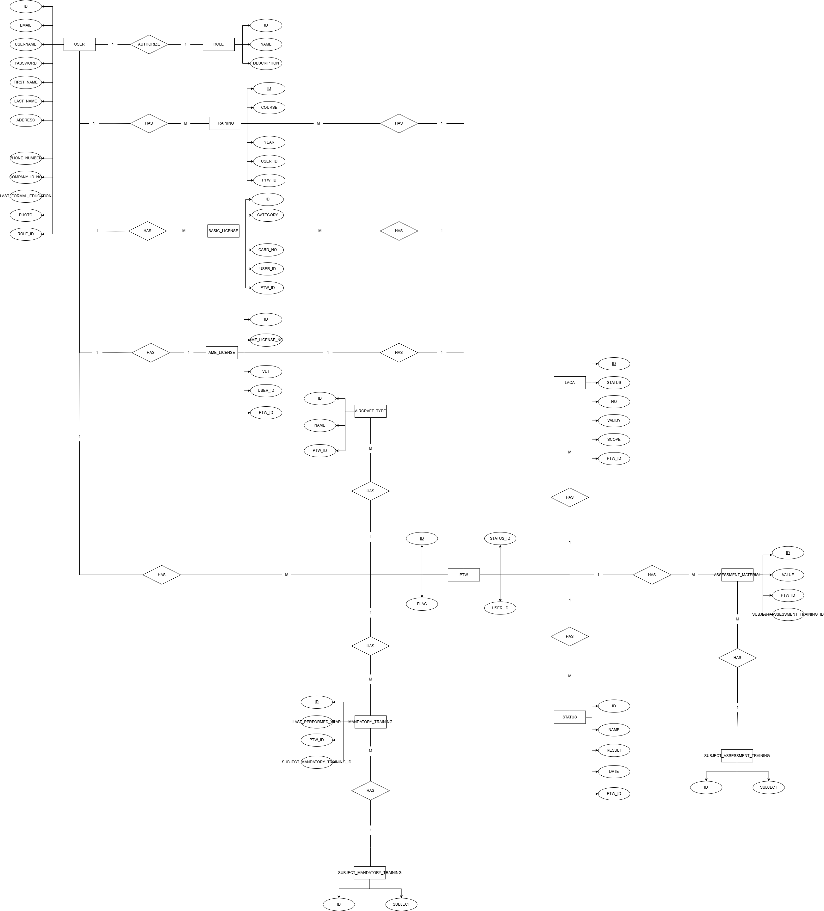

# Setting up a Laravel project

1. Clone the Laravel Project

```
git clone <repository-url> <project-folder>
```

2. Navigate to the Project Directory

```
cd <project-folder>
```

3. Install Dependencies

```
composer install
```

4. Set Up the Environment File

```
cp .env.example .env
```

5. Generate the Application Key

```
php artisan key:generate
```

6. Configure the Environment Variables

### MySQL version:

```
DB_CONNECTION=mysql
DB_HOST=localhost
DB_PORT=3306
DB_DATABASE=your_database_name
DB_USERNAME=your_username
DB_PASSWORD=your_password
```

### Postgres version:

```
DB_CONNECTION=pgsql
DB_HOST=localhost
DB_PORT=5432
DB_DATABASE=your_database_name
DB_USERNAME=your_username
DB_PASSWORD=your_password
```

7. Set Up the Database

```
php artisan migrate
```

8. Seed the Database

**Note:** The password for all accounts is set to "password."

There are four roles: Admin, Engineer, PIC, and Quality Inspector.

There are:

-   1 Admin account
-   2 Engineer account
-   2 PIC account
-   2 Quality Inspector account

To log in, refer to the `users` table in your local database, as the data is generated using the Faker library.

```
php artisan db:seed
```

9. Create the symbolic link

```
php artisan storage:link
```

10. Serve the application

```
php artisan serve
```

---

<br>

## ERD


